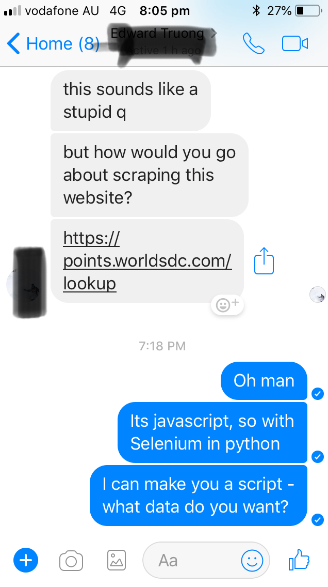

Q: How do you scrape data off a website that's rendered in Javascript? 

A: The Selenium module in Python. 

In this post I will go over he can use Selenium in Python to interact with website objects that are rendered in javascript so that we can do things like: 

* Hover-over dropdown menus 
* Select sub-menus
* Fill in text entry fields such as username and password to perform login operations 
* Basically use the .click() and .find_element_by_xpath() functions to do everything 

Building a webscraper/crawler to programmatically pull data from the internet is a really commonly sought after skill. Most businesspeople put together reports that are usually some sort of aggregation on multiple csv files that all need to get pooled together and joined in a summarized form.

Because of the iterative nature of these reports (daily, weekly, monthly, quarterly) the process of requesting and pooling the data together can be extremely tedious, especially if you have lots of data in different places. 

For this, we need the Selenium module in Python. We can pre-generate a script that will fetch our data each and every time we want to run a report - the only thing that we will change in our script between iterations will be the date variables so that we arent just pulling data for the exact same date or range every time (we will want different data otherwise theres no point doing more than one  of the same report).


### Load the Required Python Modules 

```{python}
from selenium import webdriver 
from selenium.webdriver.common.action_chains import ActionChains
import time
```

Selenium imports a set of functions that allow us to automate browser interactions with javascript rendered websites such as ipScape.

Time is a module for declaring when to pause the script and for how long in order to allow for certain operations to complete before the script races ahead of where the browser is actually at. The impact of this is that when the script looks for variables on the page they will not have been rendered yet and the script will throw an error and not proceed. For this reason we make use of the function ```time.sleep(3)``` where (3) denotes the number of seconds you want to wait. 


#### Store Username and Password in Python to Pass to the Reports Login Page

```{python}
usernameStr = 'A_Username'
passwordStr = 'A_Password'
```

#### Store the Date in Python 

The dates "From" and "To" will be sent to the ipScape date filters for the report that we run. For this reason, we will change the dates in the below command to suit the date range that we are trying to capture. Here we have declared August 11th to August 16th, so we will download data corresponding to this date range when the script runs. 

This is the only part of the script that we need to interact with - have fun!

date_From = "11/08/2018 00:00:00"
date_To = "16/08/2018 00:00:00"

#### Load the Required Webdriver - Here we use the Google Chrome driver

browser = webdriver.Chrome('/Users/Davide/Downloads/chromedriver')

#### Navigate to the Page

browser.get('https://winepeoplev5.ipscape.com.au/workspace')

#### Store an Actions Object from the Selenium Module for Interacting with Javascript Rendered Page Objects

action = ActionChains(browser)

#### Find the Username Field in the Login Form and Enter Username

username = browser.find_element_by_class_name('login_text')

username.send_keys(usernameStr)

#### Find the Password Field and Enter Password

password = browser.find_element_by_class_name

password = browser.find_element_by_name('pwd')

password.send_keys(passwordStr)

#### Find and Click Login

login = browser.find_element_by_id('loginbttn')

login.click()

#### Go to the First Reports Page

report1 = browser.find_element_by_link_text('Live Reports')

report1.click()

#### Hover Over the Administration Dropdown

time.sleep(5)

historical_reports = browser.find_element_by_xpath('//*[@id="ui-id-10"]')

time.sleep(3)

historical_reports.click()

time.sleep(5)

firstLevelMenu = browser.find_element_by_xpath('//*[@id="header_container"]/nav/div/ul/li[2]/a')

action.move_to_element(firstLevelMenu).perform()

time.sleep(2)

#### Find and Click the Reports Subheading of the Administration Dropdown

secondLevelMenu = browser.find_element_by_xpath('//*[@id="report-management-dialog-invoke"]')

action.move_to_element(secondLevelMenu).perform()

secondLevelMenu.click()

time.sleep(4)

search_reports = browser.find_element_by_xpath('//*[@id="report_search_string"]')

search_reports.send_keys("Historical Inbound Upsell")

time.sleep(2)

search_report_again = browser.find_element_by_xpath('//*[@id="report_search_button"]')

time.sleep(1)

search_report_again.click()

time.sleep(6)

edit_report_again = browser.find_element_by_xpath('//*[@id="report-list-table"]/tbody/tr/td[4]/button[2]/a')

time.sleep(2)

edit_report_again.click()

time.sleep(2)

filter_report_again = browser.find_element_by_xpath('//*[@id="ui-accordion-report-create-edit-accordion-header-1"]')

time.sleep(2)

filter_report_again.click()

time.sleep(3)

campaign_again = browser.find_element_by_xpath('//*[@id="report-filters-table"]/tbody/tr[1]/td[2]/label/select')

time.sleep(2)

campaign_again.click()

time.sleep(2)

campaign_is_in_again = browser.find_element_by_xpath('//*[@id="report-filters-table"]/tbody/tr[1]/td[2]/label/select/option[2]')

time.sleep(2)

campaign_is_in_again.click()

time.sleep(2)

call_outcome_again = browser.find_element_by_xpath('//*[@id="report-filters-table"]/tbody/tr[2]/td[2]/label/select')

time.sleep(2)

call_outcome_again.click()

time.sleep(2)

call_outcome_again_is_in = browser.find_element_by_xpath('//*[@id="report-filters-table"]/tbody/tr[2]/td[2]/label/select/option[2]')

time.sleep(2)

date_time_range_again = browser.find_element_by_xpath('//*[@id="report-filters-table"]/tbody/tr[3]/td[2]/label/select')

time.sleep(4)

date_time_range_again.click()

date_time_range_again.click()

date_time_range_again.click()

date_time_range_again.click()

time.sleep(4)

date_time_range_again_is_range = browser.find_element_by_xpath('//*[@id="report-filters-table"]/tbody/tr[3]/td[2]/label/select/option[3]')

time.sleep(4)

date_time_range_again_is_range.click()

date_time_range_again_is_range.click()

date_time_range_again_is_range.click()

date_time_range_again_is_range.click()

time.sleep(2)

filter_bar = browser.find_element_by_xpath('//*[@id="ui-accordion-report-create-edit-accordion-header-1"]')

time.sleep(4)

filter_bar.click()

time.sleep(10)

date_from_agen = browser.find_element_by_name("filter_value_from[14010790]")

time.sleep(2)

date_from_agen.clear()

date_from_agen.send_keys(date_From)

time.sleep(3)

date_to_agen = browser.find_element_by_name("filter_value_to[14010790]")

time.sleep(2)

date_to_agen.clear()

date_to_agen.send_keys(date_To)

time.sleep(2)

save_report_again = browser.find_element_by_xpath('//*[@id="save-report-button"]')

time.sleep(2)

save_report_again.click()

time.sleep(5)

put_report_on_page_again = browser.find_element_by_xpath('//*[@id="put-report-button"]')

time.sleep(2)

put_report_on_page_again.click()

time.sleep(3)

expand_rows_third_report = browser.find_element_by_xpath('//*[@id="report_5472Pager_center"]/table/tbody/tr/td[8]/select')

time.sleep(2)

expand_rows_third_report.click()

time.sleep(2)

all_rows_third_report = browser.find_element_by_xpath('//*[@id="report_5472Pager_center"]/table/tbody/tr/td[8]/select/option[11]')

time.sleep(2)

all_rows_third_report.click()

time.sleep(3)

download_third_report = browser.find_element_by_xpath('//*[@id="report_page_container"]/div/table/tbody/tr/td[1]/div/button[8]')

time.sleep(2)

download_third_report.click()

time.sleep(5)


